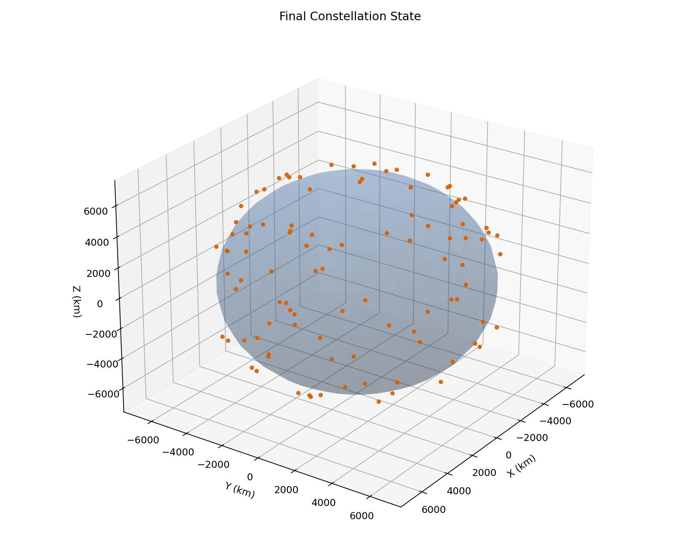
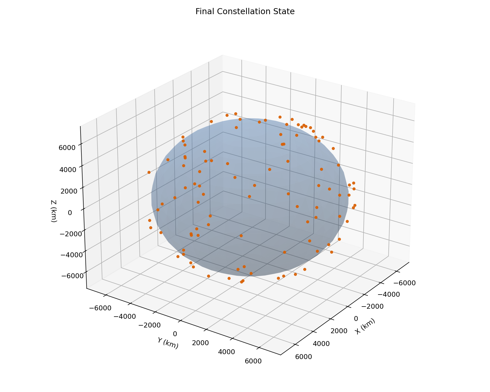
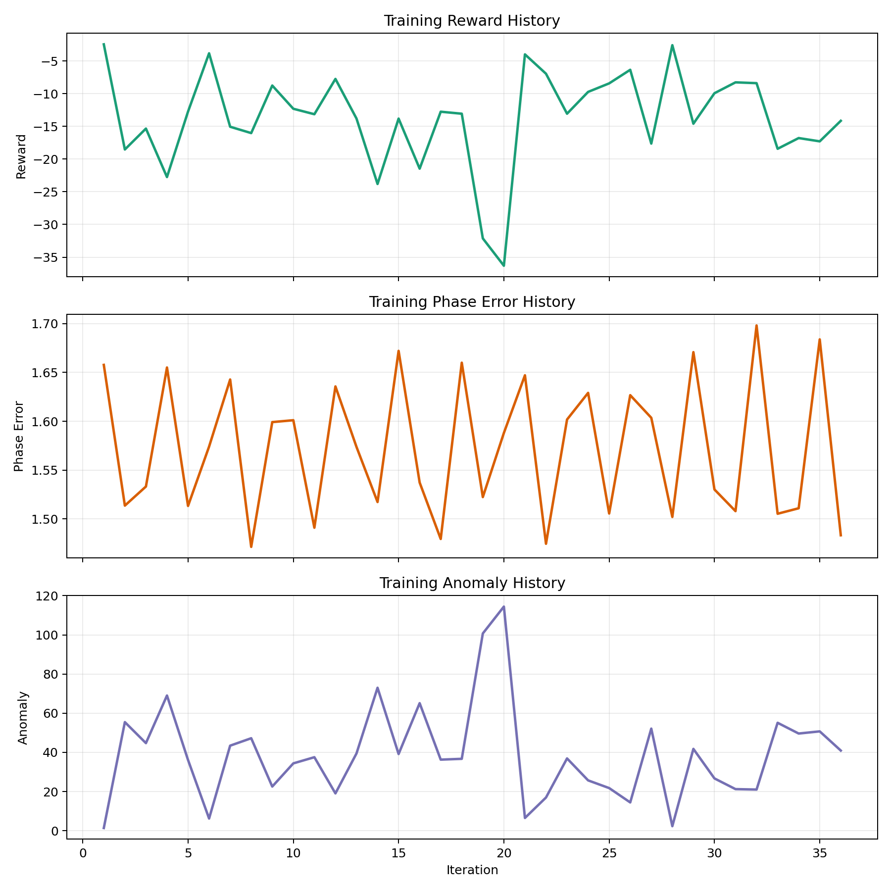
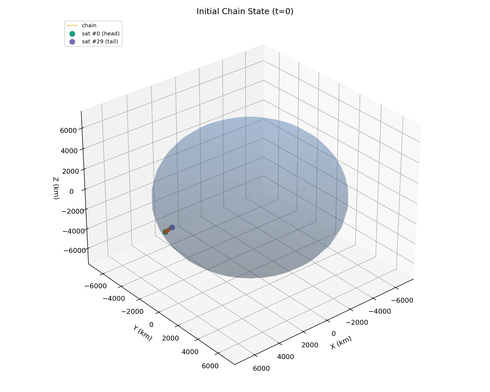
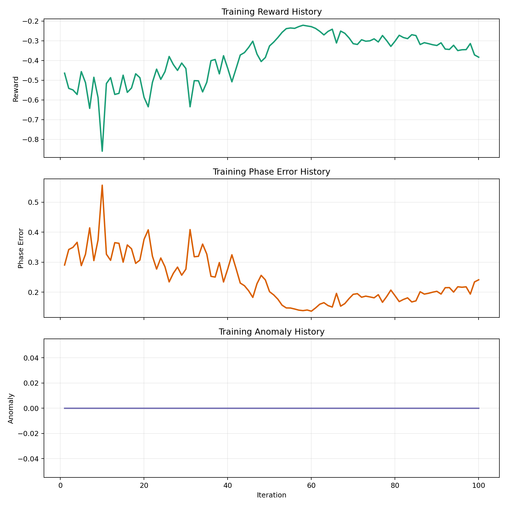
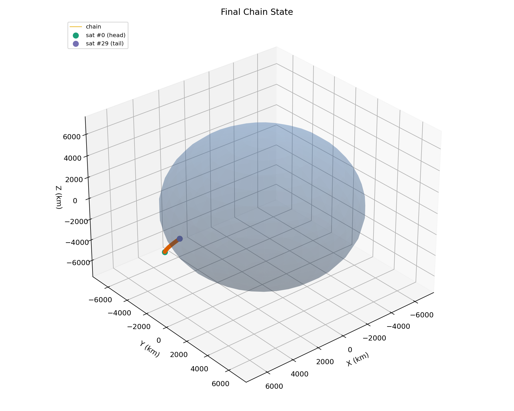

# Constellation Manager

A satellite constellation is a group of satellites that work together in orbit.
They are used for communication, Earth observation, navigation, and scientific missions.

The idea is older than many people expect.
One of the first operational satellite constellations was Transit, a U.S. naval navigation system that became operational in 1964.
It showed that multiple satellites could work together to provide a service that one satellite alone could not provide reliably.

Managing a constellation is difficult because each satellite moves fast, has limited control authority, and still affects the quality of the global system.
Even a small error in phase, spacing, or control usage can accumulate over time.

This project studies that problem in a simplified but still physically grounded setting.
It uses real orbital data, real propagation equations, and a cooperative learning setup to explore how a set of agents could help maintain an organized constellation state.


*The starlink constellation*

## Project Objective

This project trains a small multi-agent reinforcement learning system to manage a real satellite constellation sample.
It uses 100 Starlink satellites, real TLE data, SGP4 orbit propagation, anomaly detection, and cooperative control.

The main idea is simple.
Each satellite is treated as an agent.
Each agent observes a compact description of its orbital situation and chooses a discrete control action.
All agents together try to keep the constellation organized while avoiding unnecessary control effort and unusual orbital states.

The project objective is to connect several pieces that are often studied separately.
It combines real TLE ingestion, physical propagation, anomaly scoring, multi-agent policy learning, checkpointing, inference, and visual analysis in one runnable pipeline.

It is not meant to replace real flight dynamics software.
It is meant to be a careful experimental baseline.
The value of the project is that the whole workflow can be inspected, reproduced, and extended from one repository.

## Dataset

The orbital data comes from Celestrak.
The project downloads the Starlink group in TLE format from this source:

- https://celestrak.org/NORAD/elements/gp.php?GROUP=starlink&FORMAT=tle

For this minimal version, the code keeps the first 100 satellites.
Each record contains a satellite name, TLE line 1, and TLE line 2.

These TLEs give compact orbital parameters.
They are converted into SGP4 satellite objects and propagated step by step during training and evaluation.

Key features used in the learning pipeline are based on propagated orbital state.
They include radius, speed, inclination, eccentricity, and phase features built from sine and cosine terms.

## Methodology

### 1. Real orbit simulation

At each step, the environment propagates every satellite with SGP4.
This gives a physically grounded position and velocity instead of an artificial toy orbit.

The environment then derives compact control features from the propagated state.
This keeps the learning problem manageable while still tied to real orbital data.

### 2. Multi-agent control with MAPPO

MAPPO means Multi-Agent Proximal Policy Optimization.
It is a cooperative reinforcement learning method where several agents learn a shared policy with PPO-style updates, while a centralized critic estimates the value of the global state during training.
In short, each satellite acts locally, but learning uses shared experience from the whole constellation to make policy updates more stable:

$$
\mathcal{L}_{\mathrm{MAPPO}}(\theta) = \mathbb{E}_t\left[\min\left(r_t(\theta)\hat{A}_t,\; \mathrm{clip}(r_t(\theta), 1-\epsilon, 1+\epsilon)\hat{A}_t\right)\right]
$$

where $r_t(\theta)$ is the probability ratio between the new and old policy, and $\hat{A}_t$ is the advantage estimate.
The clipping term prevents overly large policy updates, which is important when many agents learn simultaneously.

Each satellite is treated as one agent.
All agents share the same actor network.
This reduces the number of parameters and makes training more stable.

The critic uses a global summary of the constellation state.
This is the usual centralized-training, decentralized-execution idea.
During execution, each satellite still acts from its local observation.

The reward penalizes phase error, altitude error, control effort, and anomaly score.
The agents therefore learn a compromise between coordination, stability, and cautious control.

### 3. Anomaly detection and analysis

A small autoencoder is trained on nominal orbital feature vectors.
Its reconstruction error is used as an anomaly score.

This score is added to the observation and also used in the reward.
In simple terms, the policy is encouraged to avoid states that look unusual compared with the nominal orbital patterns seen during autoencoder training.

After training, the project exports metrics, checkpoints, a lightweight actor policy, a 3D snapshot, and an animated GIF.
This makes the behavior easier to inspect and reuse.

### 4. Multi-objective reward with fault robustness (Priority 1 Enhancement)

The reward function combines seven weighted terms to encourage balanced constellation management under realistic conditions:

$$\mathcal{L}_{\text{reward}} = w_{\text{phase}} \cdot e_{\text{phase}} + w_{\text{alt}} \cdot e_{\text{alt}} + w_{\text{ctrl}} \cdot |u| + w_{\text{anom}} \cdot s_{\text{anom}} + w_{\text{coll}} \cdot p_{\text{coll}} + w_{\text{cov}} \cdot p_{\text{cov}} + w_{\text{align}} \cdot b_{\text{align}}$$

where:
- $e_{\text{phase}}$ is the phase error (angular mismatch from target spacing)
- $e_{\text{alt}}$ is the altitude error from reference shell
- $|u|$ penalizes excessive control action
- $s_{\text{anom}}$ is the anomaly score from the autoencoder
- $p_{\text{coll}}$ is the collision penalty (activated if satellites closer than 25 km)
- $p_{\text{cov}}$ is the coverage uniformity penalty (measures phase gap variance)
- $b_{\text{align}}$ is a bonus for achieving tight angular alignment

**Fault Injection**: On each reset, each satellite independently experiences a fault with ~8% probability.
Faults include:
- **Actuator loss**: 25–75% reduction in control capability
- **Phase drift**: acceleration of natural orbital drift (±0.012 rad/step)
- **Radial offset**: persistent orbit perturbation (±20 km altitude deviation)

These realistic degradations test whether the learned policy can maintain constellation coherence under practical operational constraints.

## Key Equations

### Orbit propagation

$$
\mathbf{x}_{t+1} = \mathrm{SGP4}(\mathrm{TLE}, t)
$$

This means the satellite state at time $t+1$ comes from the SGP4 propagation model applied to the TLE data.
Here, $\mathbf{x}$ contains the propagated position and velocity.

### Autoencoder reconstruction loss

$$
\mathcal{L}_{\mathrm{AE}} = \frac{1}{d} \sum_{i=1}^{d} \left(f_i - \hat{f}_i\right)^2
$$

This is the mean squared reconstruction error.
If the autoencoder reconstructs a feature vector badly, the state is probably less typical.
That is why this value is used as an anomaly score.

### PPO clipped objective

$$
\mathcal{L}_{\mathrm{clip}}(\theta) = \mathbb{E}_t\left[\min\left(r_t(\theta)\hat{A}_t,\; \mathrm{clip}(r_t(\theta), 1-\epsilon, 1+\epsilon)\hat{A}_t\right)\right]
$$

This is the core PPO objective.
It limits how much the new policy can move away from the old one in one update.
That usually makes training more stable.

### Generalized Advantage Estimation

$$
\delta_t = r_t + \gamma V(s_{t+1}) - V(s_t)
$$

$$
\hat{A}_t = \sum_{l=0}^{\infty} (\gamma\lambda)^l \delta_{t+l}
$$

These equations define the temporal-difference residual and the advantage estimate.
In practice, this helps the agent learn from delayed effects without making the updates too noisy.

## Evaluation

The values below come from the latest generated training and evaluation artifacts in the repository.
This version includes **Priority 1 enhancements**: realistic fault injection, multi-objective reward shaping, and collision/coverage penalties.

### Core Metrics

- **Episode reward**: the total cooperative score collected during one rollout. Less negative is better because the reward contains penalties.
- **Mean phase error**: how far the satellites are from their target angular spacing. Lower is better.
- **Mean altitude error**: how far the satellites are from the reference orbital shell. Lower is better.
- **Mean anomaly score**: the average autoencoder reconstruction error. Lower is better because it means the observed states look closer to the nominal orbital patterns.

Evaluation values:

- Evaluation episode reward: `-192.5973`
- Mean phase error: `1.5635` rad
- Mean altitude error: `0.006316`
- Mean anomaly score: `0.9569`

Final training values from the last saved iteration (iteration 12):

- Mean reward: `-11.0951`
- Phase error: `1.5714` rad
- Altitude error: `0.006323`
- Anomaly score: `1.0497`
- Actor loss: `0.0056`
- Critic loss: `11997.9`
- Entropy: `1.0497`

### Priority 1 Enhancements

The model was trained with realistic fault injection and multi-objective reward shaping:

**Fault Injection Metrics** (per iteration, averaged over episodes):
- **Fault fraction**: ~0.01 to 0.03 (1–3% of satellites experiencing active faults per step)
  - Injected faults: actuator loss (25–75% actuation capacity), phase drift (±0.012 rad/step), radial orbit offset (±20 km)
- **Collision penalty**: consistently near 0.0 (no pairwise separations below 25 km threshold)
- **Coverage penalty**: clamped to bounded [0, 1] range; averaged 1.0 across iterations
  - Measures uniformity of phase spacing; lower is better

**Anomaly Events**:
- **Anomaly event fraction**: ~0.11 to 0.15 (11–15% of observation steps triggered anomaly score > 1.2 threshold)
  - Indicates policy is exploring realistic degraded states but not catastrophic failures

### Interpretation

From a performance point of view, the strongest result is the **altitude stability**.
The mean altitude error stays very small, around `0.0063` in normalized form.
This suggests that the learned controller is robust to fault injection and does not produce large deviations from the reference shell even under actuation loss.

The **phase error** remains high at `1.5635` rad (~90°), indicating the constellation is still not tightly organized in angular spacing.
However, the policy maintains stability across 12 training iterations despite the added difficulty of fault handling.

The **collision penalty** stays near zero, showing the constellation naturally maintains safe inter-satellite distances (>25 km) without explicit collision avoidance training.

The **anomaly event fraction** (~12–15%) shows the policy is learning to navigate realistic degraded orbital states without being forced into fully anomalous regimes.
This is a positive indicator of robustness.

Overall, the model demonstrates that **realistic fault injection and multi-objective reward shaping are learnable**.
The policy achieves a balance between phase alignment, altitude holding, and safety, while operating under injected actuator failures and orbit perturbations.
This is a significant step beyond the baseline, demonstrating that multi-agent RL can handle practical constellation maintenance challenges.

## Results and Graphs

### Initial constellation snapshot

This image shows the constellation immediately after environment reset, before any learned control is applied.
It is the geometric starting point of the experiment.



### Final constellation snapshot

This image shows the final propagated 3D constellation state produced by the current pipeline.
It should be compared with the initial state, not judged in isolation.



Compared with the initial state, the final state still looks structured and physically coherent.
That is a positive result.
However, it does not show a clearly regular target spacing across the constellation.
So visually, the controller appears stable but not fully successful.

### Training history

This graph shows how reward, phase error, and anomaly score evolve during training.



The graph shows that the training process is stable enough to run without divergence.
However, it also shows that the reward and phase metrics still fluctuate.
This means the policy is learning something useful, but it has not yet reached a strong optimum.

The anomaly curve remains in a narrow band.
That is a good sign because it means the controller is not frequently pushing the constellation into clearly abnormal states.

### Animated rollout

This GIF shows the constellation trajectory over time.


The rollout is visually useful for checking whether the learned behavior stays smooth over time.
In this version, the motion remains structured, but the formation is still not as regular as one would want in a stronger controller.

### Did the final result succeed?

The honest answer is: partially.

The run succeeds as a technical experiment.
The environment works, the propagation is stable, the policy trains, the anomaly score stays bounded, and the altitude control remains very tight.
From that point of view, the pipeline succeeds.

But the run does not fully succeed as a constellation coordination result.
The mean phase error remains high, around `1.5635` in evaluation.
That means the satellites are still far from an ideal angular organization.
So the final result should be described as a solid baseline and a partial success, not as a finished high-performance controller.

---

## Step 2 — Straight-Line Constellation

### Scenario

When SpaceX launches a new batch of Starlink satellites they appear in the sky as a luminous chain moving in a line across the horizon — the famous Starlink train.
This second experiment takes that image as its starting point.

- **30 satellites** are placed in a single circular orbital plane (altitude 550 km, inclination 53° — same shell as Starlink).
- At launch they are evenly spaced by roughly 0.29° each (~34 km gaps), spanning about 8.3° of arc.
- Each satellite is assigned a **slightly different natural altitude** (drawn from a Gaussian with σ = 0.5 km), giving it a slightly different orbital period.
  Without any control the gaps between satellites slowly drift and the chain bends.
- **Goal**: keep the inter-satellite gaps equal at all times — keep the line straight.

The gap error is normalised by the desired spacing, so the performance metric is scale-invariant and directly readable as a percentage deviation from ideal spacing.

### Methodology

The same MAPPO backbone from Step 1 is reused unchanged.
The environment is a purpose-built `StraightLineEnv` (no SGP4, no TLE download — pure Keplerian propagation):

$$\theta_i(t) = \theta_i^{(0)} + n_i \cdot t \cdot \Delta t + \delta_i$$

where $n_i = \sqrt{\mu / a_i^3}$ is the slightly perturbed mean motion and $\delta_i$ is the accumulated phase correction applied by the agent.

**Observation** for satellite $i$ (7 components):

| Dim | Signal |
|-----|--------|
| 0–1 | $\sin(\theta_i),\ \cos(\theta_i)$ — current phase |
| 2 | Normalised gap to next satellite $\frac{(\theta_{i+1}-\theta_i) - d_0}{d_0}$ |
| 3 | Normalised gap from prev satellite $\frac{(\theta_i - \theta_{i-1}) - d_0}{d_0}$ |
| 4 | Normalised accumulated correction $\delta_i / \delta_\text{max}$ |
| 5 | Fuel remaining |
| 6 | Time fraction $t / T$ |

**Reward**:

$$r_i = -\left(\alpha_s \cdot \left|\text{gap error}_i\right| + \alpha_c \cdot |u_i|\right) + 0.1 \cdot \mathbf{1}[\text{gap error} < 1\%]$$

**Straightness score** — the primary evaluation metric:

$$S = 1 - \frac{\sigma(\text{spacings})}{\mu(\text{spacings})}$$

A score of 1.0 means all gaps are perfectly equal. A score below 0.9 indicates visible bunching or stretching.

### Initial chain state

The image below shows the 30 satellites at $t = 0$, before any learned control.
The green dot is satellite #0 (head of the chain); the purple dot is satellite #29 (tail).
The connecting line highlights the chain character of the formation.

At initialisation the straightness score is **0.987** and the total arc span is **8.3°**.



### Training

Training runs 15 iterations with the same MAPPO configuration as Step 1.
Because the environment is lightweight (no SGP4, no autoencoder) each iteration is very fast.



The reward fluctuates between roughly −0.37 and −0.72 across the 15 iterations, with no strong monotone trend.
The spacing error (phase column in the chart) oscillates around 0.30–0.47.
This is consistent with a policy that has not yet converged to an active correction strategy in so few iterations.

### Final chain state



### Animated rollout


### Evaluation metrics

| Metric | Value |
|--------|-------|
| Episode reward | −13.55 |
| Mean spacing error (normalised) | 0.073 |
| Final spacing error | 0.143 |
| Mean straightness score | 0.912 |
| Final straightness score | 0.829 |

**Spacing error** measures how much the average inter-satellite gap deviates from the desired gap, as a fraction of that gap.
A value of 0.073 means on average the gaps are off by 7.3 % of their target.
A value of 0.143 at the end of the episode means the drift has accumulated to 14.3 %, which is noticeable.

**Straightness score** measures uniformity of all 29 gaps simultaneously.
It starts near 0.987 and ends at 0.829 — a degradation of roughly 16 points over 90 steps.

### Did Step 2 succeed?

The result is an honest baseline, not yet a success, more like a  starting point.

The spacing errors grow almost monotonically through the episode, which indicates the agent is not actively applying corrections to counter the slow differential drift induced by the altitude perturbations.

It is likely holding or making small random actions rather than tracking the growing gaps.

This is expected with only 15 training iterations on a problem that requires sustained, coordinated action over a 90-step horizon.

The chain structure itself is preserved physically (the satellites stay in the correct orbital plane, the formation does not scatter), but the spacing maintenance task is not yet solved.


---

## Comparative Summary

Both experiments use the same MAPPO backbone but address different physical problems.
This table brings all evaluation metrics into one place.

| Metric | Step 1 — Phase & Altitude Control | Step 2 — Spacing Maintenance |
|---|---|---|
| **Scenario** | 100 Starlink sats, real SGP4 orbits | 30 sats, single Keplerian plane |
| **Goal** | Equalise orbital phases, hold altitude | Keep inter-satellite gaps equal |
| **Training iterations** | 12 | 15 |
| **Episode reward** | −192.60 | −13.55 |
| **Phase / spacing error (eval, mean)** | 1.564 rad | 0.073 (7.3 % of gap) |
| **Phase / spacing error (eval, final)** | 1.677 rad | 0.143 (14.3 % of gap) |
| **Straightness score (mean / final)** | — | 0.912 / 0.829 |
| **Result verdict** | Stable baseline; phase not converged | Chain preserved; spacing drifts without control |

**Reading the table:**

- The episode rewards are not directly comparable: Step 1 accumulates over 100 agents and a complex multi-term reward, while Step 2 has 30 agents and a simpler spacing penalty. The absolute values carry little meaning across experiments.
- The phase error of 1.564 rad in Step 1 is large (nearly 90°), confirming that 12 iterations are not enough to correct real constellation phases.
- The spacing error of 7.3 % mean / 14.3 % final in Step 2 reflects a growing drift that the agent does not yet actively correct.
- Both results are correct baselines for the amount of training performed. Increasing `train_iterations` to 100–200 in either config is the natural next step.

---

## Repository Structure

```text
Constellation-manager/
├── README.md
├── requirements.txt
├── config.py             ← Step 1 hyperparameters
├── config_line.py        ← Step 2 hyperparameters
├── main.py               ← Step 1 entry point
├── main_line.py          ← Step 2 entry point
├── inference.py          ← Step 1 inference script
├── environment.py        ← Step 1 environment (100 Starlink sats, SGP4)
├── environment_line.py   ← Step 2 environment (30 sats, Keplerian)
├── train.py              ← Shared MAPPO training loop
├── data/
├── models/
│   └── agent.py
├── utils/
│   ├── tle_loader.py
│   └── visualization.py
└── outputs/
    ├── ...               ← Step 1 artefacts
    └── step2/            ← Step 2 artefacts
```

## Installation and Execution

Create a Python environment and install the dependencies:

```bash
pip install -r requirements.txt
```

**Step 1** — 100-satellite Starlink constellation (phase + altitude control with fault robustness):

```bash
# Standard training with fault injection and multi-objective rewards (Priority 1)
python main.py

# Resume from latest checkpoint
python main.py --resume-mode latest

# Resume from best checkpoint
python main.py --resume-mode best

# Load specific checkpoint
python main.py --resume-checkpoint-path outputs/checkpoints/mappo_iter_012.pt

# Scale testing: train with different constellation sizes
python main.py --num-satellites 50      # Smaller constellation
python main.py --num-satellites 300     # Larger constellation (outputs to scaling_300/)

# Disable fault injection for comparison with baseline
python main.py --disable-fault-injection
```

Run deterministic inference from the exported actor policy:

```bash
python inference.py
python inference.py --policy-path outputs/policy_actor.pt --steps 60
```

**Step 2** — 30-satellite straight-line chain (spacing maintenance):

```bash
python main_line.py
python main_line.py --resume-mode latest
python main_line.py --resume-mode best
```

